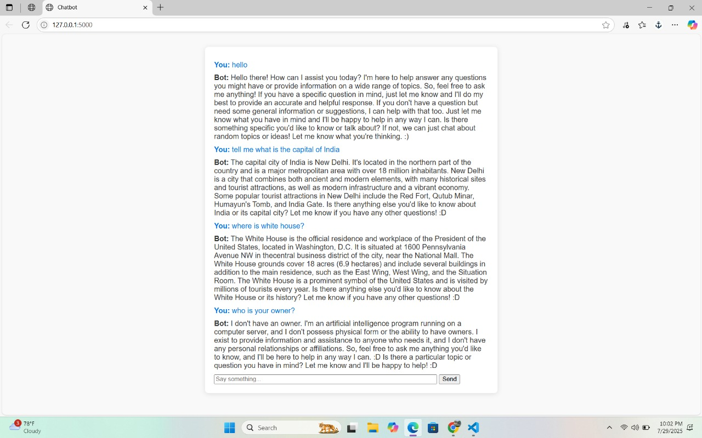

# 💬 LangChain Chatbot Web App

A conversational AI chatbot built using LangChain, OpenAI API, and Streamlit.  
This project showcases how to build context-aware bots using LLMs and serve them via a simple web UI.  
🔐 API keys are managed securely via `.env` file (see `.env.example`)  
📸 Includes demo image and clean, minimal UI design for better UX.

## 🔍 Preview

